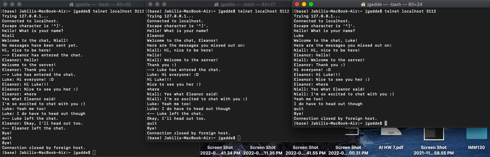

# Haskell Chat Server

This repository contains the code for my Honors Project for CSC 435: Programming Languages.

The code can be found in the [Main.hs](app/Main.hs) file and the dependencies used in the project can be found in [ChatServer.cabal](ChatServer.cabal#L38-L42). 

This project can have multiple clients connect to a chat server in the command line and communicate with each other. Additionally, any clients that join late will be able to see a history of the chats. 

## Installation Instructions
Navigate to the directory that you want to clone this repository into.
Run the following command in the command line:

    git clone git@github.com:gaddej1/haskell_chat_server.git

Install Haskell by following these [instructions](https://www.haskell.org/ghcup/).
Install Cabal by following these [instructions](https://www.haskell.org/cabal/).

## Launching the Chat Server
Run the following command in the command line:

    cabal run
    
Open another command line and run the following command to join with as many clients as you like:
  
    telnet localhost 3112
    
You can quit from a client by typing quit.

## About How I Implemented the Chat Server
I first created a socket and binded it to TCP port 3112. Essentially, this creates a place that listens for clients that are looking to connect to the chat server. 
The socket accepts connections and then runs the connection in a separate thread of execution. The socket will continue to accept connections and run them in different threads as long as the server is running. Because the connections are running in separate threads of execution, the connections are running concurrently or at the same time.
Once the server accepts the connection from a client looking to join the chat server, the program will ask the client for their name. It will then send a message to all the other clients that that client has joined the chat. It will also welcome the client to the chat.

After that, the client can send and receive messages to and from the other clients. This is done by communicating with other threads of execution. Essentially, when a client sends a message, the program broadcasts it to the other threads of execution, where that thread will print the message out to the client. This is done continually, so each thread will always be listening for messages that are being sent to their client connection.

If a client wants to quit the chat server, then the program will bid the client goodbye, kill that thread of execution, and broadcast to the other clients that that person has left. 

Additionally, there is a history feature, where if a client joins after messages have already been sent, then the client can see all the past sent messages. This is done by storing all the messages and associated client name in a database, retrieving all those messages every time a new client joins, and then printing out the messages to the new client.

